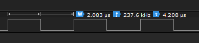
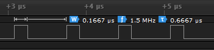
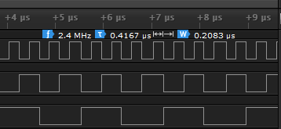
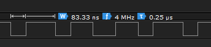

## SAM Board (Arduino Due) Benchmarks

### Contents
* [Benchmarks](#user-content-benchmarks)
  * [Arduino I/O](#user-content-arduino-io)
  * [Direct I/O](#user-content-direct-io)
  * [Direct I/O with Dynamic Pin Numbers](#user-content-direct-io-with-dynamic-pin-numbers)
  * [8-Bit Port using Arduino I/O](#user-content-8-bit-port-using-arduino-io)
  * [8-Bit Port using DirectIO](#user-content-8-bit-port-using-directio)

### Benchmarks
#### Arduino I/O

Here's a short sketch that drives an output pin as fast as possible:  
  
```C++
#define PIN 2  

void setup() {  
    pinMode(PIN, OUTPUT);  
}  

void loop() {  
  while(1) {  
    digitalWrite(PIN, HIGH);  
    digitalWrite(PIN, LOW);  
  }  
}  
```

This generates the following code:  
```
00080148 <setup>:
   80148: 2002        movs  r0, #2
   8014a: 2101        movs  r1, #1
   8014c: f000 bd38   b.w 80bc0 <pinMode>
```

In this loop, each write to the output requires 3 instructions to set up a call to `digitalWrite`. 
  
```
00080150 <loop>:
   80150: b508        push  {r3, lr}
   80152: 2002        movs  r0, #2
   80154: 2101        movs  r1, #1
   80156: f000 fdb7   bl  80cc8 <digitalWrite>

   8015a: 2002        movs  r0, #2
   8015c: 2100        movs  r1, #0
   8015e: f000 fdb3   bl  80cc8 <digitalWrite>

   80162: e7f6        b.n 80152 <loop+0x2>
```

Each pass through the loop takes ~350 cycles, which gives an output frequency of ~237 KHz.



#### Direct I/O

Here's the same loop, using the DirectIO library:

```C++
#include <DirectIO.h>  

Output<2> pin;  

void setup() {}  

void loop() {  
  while(1) {  
    pin = HIGH;  
    pin = LOW;  
  }  
}  
```

setup() is now empty, and the initialization is done in the constructor of the global variable 'pin':
```
00080148 <setup>:
   80148: 4770        bx  lr
  ...

0008015c <_GLOBAL__sub_I_pin>:
   8015c: b508        push  {r3, lr}
   8015e: 2002        movs  r0, #2
   80160: 2101        movs  r1, #1
   80162: f000 fd33   bl  80bcc <pinMode>
   80166: e8bd 4008   ldmia.w sp!, {r3, lr}
   8016a: 2002        movs  r0, #2
   8016c: 2100        movs  r1, #0
   8016e: f000 bdb1   b.w 80cd4 <digitalWrite>
```

In the new loop, each write to the output is a single instruction. This is what makes the DirectIO library so fast.

```
0008014c <loop>:
   8014c: 4b02        ldr r3, [pc, #8]  ; (80158 <loop+0xc>)
   8014e: f04f 7200   mov.w r2, #33554432 ; 0x2000000

   80152: 631a        str r2, [r3, #48] ; 0x30     ; sets pin high
   80154: 635a        str r2, [r3, #52] ; 0x34     ; sets pin low

   80156: e7f9        b.n 8014c <loop>
   80158: 400e1000  .word 0x400e1000
```

Each pass through the loop takes 8 cycles, which gives an output frequency of 
10.5 MHz - over 40x faster than the native Arduino I/O.



#### Direct I/O with Dynamic Pin Numbers

On SAM and SAMD boards, the dynamic pin number classes (InputPin and OutputPin) are not accelerated at this time, so performance is identical to the `digitalRead` and `digitalWrite` case. This is an opportunity for future improvement using the same technique used for the AVR case.

#### 8-Bit Port using Arduino I/O

Here is an example sketch that writes a series of values to an 8-bit output port (on pins 0-7).

```C++
#define FIRST_PIN 0

void setup() 
{
  for(uint8_t i = 0; i < 8; i++) {
   pinMode(FIRST_PIN + i, OUTPUT);
  }
}

void loop() {
  uint8_t value = 0;
  
  while(1) {
    for(uint8_t i = 0; i < 8; i++) {
     digitalWrite(FIRST_PIN + 7 - i, bitRead(value, i));
    }
    value++;
  }
}
```

The low order bit is cycling at 27 KHz, so the loop is running at 54 KHz. This is due to the large number of calls to `digitalWrite`.


#### 8-Bit Port using DirectIO

Here is the same example using DirectIO:
```C++
#include <DirectIO.h>

OutputPort<PORT_D> port;

void setup() {
    port.setup();
}

void loop() {
  u8 i = 0;
  
  while(1) {
    port = i++;
  }
}
```



The low order bit is cycling at 2.3 MHz, so the loop is executing at 4.6MHz. This is around 85x as fast as the native Arduino version.

```
   80158: 2300        movs  r3, #0
   8015a: 1c59        adds  r1, r3, #1
   8015c: b2c9        uxtb  r1, r1
   8015e: b672        cpsid i
   80160: 4a04        ldr r2, [pc, #16] ; (80174 <loop+0x1c>)
   80162: 6b90        ldr r0, [r2, #56] ; 0x38
   80164: f020 00ff   bic.w r0, r0, #255  ; 0xff
   80168: 4303        orrs  r3, r0
   8016a: 6393        str r3, [r2, #56] ; 0x38
   8016c: b662        cpsie i
   8016e: 460b        mov r3, r1
   80170: e7f3        b.n 8015a <loop+0x2>
   80172: bf00        nop
   80174: 400e1400  .word 0x400e1400
```

This is a fairly complex loop, because this is a partial I/O port: the SAM/SAMD CPUs have 32-bit I/O ports, and we are only using 8 bits. Many of the instructions here are dedicated to implementing a masked read-modify-write cycle so we don't change the contents of the other port pins.

It's uncommon to need a full 32-bit port. If we were to use one:
```C++
#include <DirectIO.h>

OutputPort<PORT_D, 0, 32> port;

void setup() {
    port.setup();
}

void loop() {
  u8 i = 0;
  
  while(1) {
    port = i++;
  }
}
```

we get a much tighter loop:

```
   8015c: 2300        movs  r3, #0
   8015e: 4902        ldr r1, [pc, #8]  ; (80168 <loop+0xc>)
   80160: 1c5a        adds  r2, r3, #1
   80162: 638b        str r3, [r1, #56] ; 0x38
   80164: b2d3        uxtb  r3, r2
   80166: e7fa        b.n 8015e <loop+0x2>
   80168: 400e1400  .word 0x400e1400
```

with the low bit cycling at 4.3 MHz, indicating 8.6M loop iterations per second.


