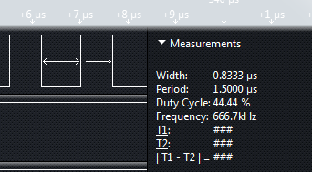

## AVR Board (Arduino Nano) Benchmarks

### Contents
* [Benchmarks](#user-content-benchmarks)
  * [Arduino I/O](#user-content-arduino-io)
  * [Direct I/O](#user-content-direct-io)
  * [Direct I/O with Dynamic Pin Numbers](#user-content-direct-io-with-dynamic-pin-numbers)
  * [8-Bit Port using Arduino I/O](#user-content-8-bit-port-using-arduino-io)
  * [8-Bit Port using DirectIO](#user-content-8-bit-port-using-directio)

### Benchmarks
#### Arduino I/O

Here's a short sketch that drives an output pin as fast as possible:  
  
```C++
#define PIN 2  

void setup() {  
    pinMode(PIN, OUTPUT);  
}  

void loop() {  
  while(1) {  
    digitalWrite(PIN, HIGH);  
    digitalWrite(PIN, LOW);  
  }  
}  
```

This generates the following code:  
```
00000234 <setup>:  
 234:   61 e0           ldi r22, 0x01   ; 1  
 236:   82 e0           ldi r24, 0x02   ; 2  
 238:   5a c0           rjmp    .+180       ; 0x2ee <pinMode>  
```

In this loop, each write to the output requires 3 instructions to set up a call to `digitalWrite`. 
  
```
0000023a <loop>:
 23a:   61 e0           ldi r22, 0x01   ; 1
 23c:   82 e0           ldi r24, 0x02   ; 2
 23e:   90 d0           rcall   .+288       ; 0x360 <digitalWrite>
 
 240:   60 e0           ldi r22, 0x00   ; 0
 242:   82 e0           ldi r24, 0x02   ; 2
 244:   8d d0           rcall   .+282       ; 0x360 <digitalWrite>
 
 246:   f9 cf           rjmp    .-14        ; 0x23a <loop>
```

Each pass through the loop takes 250 cycles. On a 16 Mhz board, this gives an output frequency of 64 KHz.


#### Direct I/O

Here's the same loop, using the DirectIO library:

```C++
#include <DirectIO.h>  

Output<2> pin;  

void setup() {}  

void loop() {  
  while(1) {  
    pin = HIGH;  
    pin = LOW;  
  }  
}  
```

setup() is now empty, and the initialization is done in the constructor of the global variable 'pin':
```
00000254 <setup>:
 254:   08 95           ret

0000025c <_GLOBAL__sub_I_pin>:
 25c:   61 e0           ldi r22, 0x01   ; 1
 25e:   82 e0           ldi r24, 0x02   ; 2
 260:   56 d0           rcall   .+172       ; 0x30e <pinMode>
 
 262:   60 e0           ldi r22, 0x00   ; 0
 264:   82 e0           ldi r24, 0x02   ; 2
 266:   8c c0           rjmp    .+280       ; 0x380 <digitalWrite>
```

In the new loop, each write to the output is a single instruction. This is what makes the DirectIO library so fast.

```
00000256 <loop>:
 256:   74 9a           sbi 0x0e, 4 ; 14    ; sets pin high
 258:   74 98           cbi 0x0e, 4 ; 14    ; sets pin low
 25a:   fd cf           rjmp    .-6         ; 0x256 <loop>
```

Each pass through the loop takes 6 cycles; on a 16 Mhz board, this
gives an output frequency of 2.66 MHz - over 40x faster than the native
Arduino I/O.


#### Direct I/O with Dynamic Pin Numbers

One more example, using pin numbers specified at runtime. Note that you should only do this if you need dynamic pin numbering; if you have constant pin numbers, use the `Output` class described above.

```C++
#include <DirectIO.h>  

OutputPin pin(2);  

void setup() {}  

void loop() {  
  while(1) {  
    pin = HIGH;  
    pin = LOW;  
  }  
}  
```

Each pass through the loop takes 75 cycles; on a 16 Mhz board, this
gives an output frequency of 214 KHz - over 3x faster than the native
Arduino I/O.



#### 8-Bit Port using Arduino I/O

Here is an example sketch that writes a series of values to an 8-bit output port (on pins 0-7).

```C++
#define FIRST_PIN 0

void setup() 
{
  for(uint8_t i = 0; i < 8; i++) {
   pinMode(FIRST_PIN + i, OUTPUT);
  }
}

void loop() {
  uint8_t value = 0;
  
  while(1) {
    for(uint8_t i = 0; i < 8; i++) {
     digitalWrite(FIRST_PIN + 7 - i, bitRead(value, i));
    }
    value++;
  }
}
```

The low order bit is cycling at 8.36 KHz, so the loop is running at 16.7 KHz. This is due to the large number of calls to `digitalWrite`.


#### 8-Bit Port using DirectIO

Here is the same example using DirectIO:
```C++
#include <DirectIO.h>

OutputPort<PORT_D> port;

void setup() {}

void loop() {
  u8 i = 0;
  
  while(1) {
    port = i++;
  }
}
```

First, the code is more readable. Second, it runs faster. A *lot* faster.


The low order bit is cycling at 2 MHz, so the loop is executing at 4MHz. This is over 200x as fast as the native Arduino version. Looking at the disassembly reveals why:
```
0000012c <loop>:
 12c:	80 e0       	ldi	r24, 0x00	; 0
 12e:	8b b9       	out	0x0b, r24	; 11
 130:	8f 5f       	subi	r24, 0xFF	; 255
 132:	fd cf       	rjmp	.-6      	; 0x12e <loop+0x2>
```

It's a 3-instruction loop that takes 4 cycles per iteration. Most of that time is spent incrementing the counter and branching back to the top of the loop. Writing all 8 bits to the port is done by the `out` instruction and takes a single cycle.
